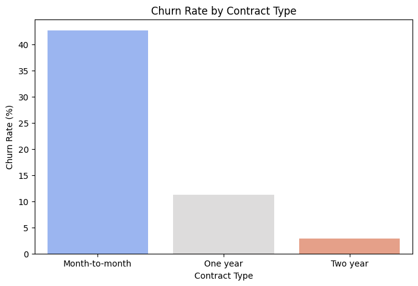

# Overview
This project focuses on analyzing customer churn using SQL for data extraction and Python for visualization. The goal is to identify key factors influencing customer churn by examining trends in contract types, payment methods, tenure, and internet service usage. The insights derived can be used for customer retention strategies and future machine learning applications.

## Tools & Technologies Used
For this <b>Customer Churn Analysis</b> project, I leveraged several key tools and technologies to explore, analyze, and visualize the data effectively:
- <b>SQL (SQLite)</b>: Used for querying and extracting meaningful customer churn insights
- <b>Python</b>: The core programming language used for data handling and visualization
    - <b>Pandas</b>: Used for data manipulation and loading SQL query results into DataFrames
    - <b>Matplotlib & Seaborn</b>: Created visual representations of churn trends to identify key insights
- <b>Jupyter Notebook</b>: Served as the interactive environment for querying, analysis, and visualization
- <b>VS Code (PowerShell Terminal)</b>: Used for writing SQL queries and executing Python scripts
- <b>Git & GitHub</b>: Essential for version control, tracking changes, and sharing the project publicly

## Project Steps
<b>Step 1</b>: Database Setup & Data Import

<b>Step 2</b>: Data Exploration & SQL Queries

<b>Step 3</b>: Fetching & Cleaning Data in Python

<b>Step 4</b>: Customer Behavior Analysis

<b>Step 5</b>: Data Visualization & Insights

<b>Step 6</b>: Documentation & Future Enhancements

## Step 1: Database Setup & Data Import
<b>Objective</b>: Set up the SQLite database and import the customer churn dataset.
### Data Analysis
- Defined the database schema, creating a `customers` table
- Imported customer churn data into an SQLite database [`customer_churn.db`](Database/customer_churn.db)

Detailed steps can be found in [`setup_db.py`](Database/setup_db.py)

### Insights
The database is ready for exploratory queries.


## Step 2: Data Exploration & SQL Queries
<b>Objective</b>: Perform SQL-based exploratory data analysis.
### Data Analysis
- Performed exploratory queries to analyze churn rates by contract type, payment method, and tenure
- Applied `GROUP BY`, `ORDER BY`, and `CASE` conditions for trend analysis

Detailed steps can be found in [`explore_data.sql`](sql/explore_data.sql)

### Query Visualization
```sql
SELECT Contract, COUNT(*) AS Total_Customers, 
       SUM(CASE WHEN Churn = 'Yes' THEN 1 ELSE 0 END) AS Churned_Customers
FROM customers 
GROUP BY Contract;
```

### SQL Query Result
Churn rates were highest among customers with <b>Month-to-month contracts</b>.

### Insights
Customers with <b>longer tenure</b> and <b>annual contracts</b> tend to have lower churn rates.


## Step 3: Fetching & Cleaning Data in Python
<b>Objective</b>: Load SQL data into Pandas and clean it for further analysis.
### Data Analysis
- Connected Python to SQLite using `sqlite3`
- Loaded SQL query results into Pandas DataFrames
- Ensured correct data types and handled missing values

Detailed steps can be found in [`eda.ipynb`](Notebooks/eda.ipynb)

### Data Visualization
```python
import sqlite3
import pandas as pd

conn = sqlite3.connect("customer_churn.db")
query = "SELECT * FROM customers;"
df = pd.read_sql(query, conn)
conn.close()
```

### Result
Data successfully fetched and loaded into Pandas for further processing.

### Insights
Ready for trend visualization and customer behavior analysis.


## Step 4: Customer Behavior Analysis
<b>Objective</b>: Identify high-risk churn patterns.
### Data Analysis
- Grouped customers based on contract type, tenure, internet service, and payment method
- Identified high-risk churn patterns among specific customer segments

Detailed steps can be found in [`2_churn_analysis.sql`](sql/2_churn_analysis.sql)

### Query Visualization
```sql
SELECT InternetService, COUNT(*) AS Total_Customers,
       SUM(CASE WHEN Churn = 'Yes' THEN 1 ELSE 0 END) AS Churned_Customers
FROM customers 
GROUP BY InternetService;
```

### SQL Query Result
Customers with DSL and Fiber optic internet showed varying churn rates.

### Insights
<b>Month-to-month contracts</b> had the highest churn rates, indicating a need for retention strategies.


## Step 5: Data Visualization & Insights
<b>Objective</b>: Create visualizations to present key trends.
### Data Analysis
- Created churn trend graphs using Seaborn & Matplotlib
- Visualized churn rate by contract type, internet service, payment method, and tenure
- Created subplots for a combined churn rate analysis

Detailed steps can be found in [`churn_visualization.ipynb`](Notebooks/churn_visualization.ipynb)

### Data Visualization
```python
import matplotlib.pyplot as plt
import seaborn as sns

plt.figure(figsize=(8,5))
sns.countplot(x='Contract', hue='Churn', data=df)
plt.title('Churn Rate by Contract Type')
plt.show()
```

### Result
 

*Churn Rate by Contract type*

### Insights
Clear visualization of customer trends aids in making data-driven business decisions.

## Step 6: Documentation & Future Enhancements
<b>Summary Report</b>: [`Report.md`](Reports/Report.md) summarizes key findings and insights

### Future Enhancements
By extending this project into a Machine Learning-based model, I can proactively predict customer churn and implement preventive strategies. Additionally, developing a dashboard will enable real-time monitoring, helping businesses improve customer retention efforts.


## Conclusion
This project effectively demonstrates how SQL and Python can be used to analyze customer churn trends. By leveraging data-driven insights, businesses can develop targeted strategies to reduce churn rates and improve customer retention. Future enhancements include integrating machine learning models for churn prediction and deploying a dashboard for real-time insights.